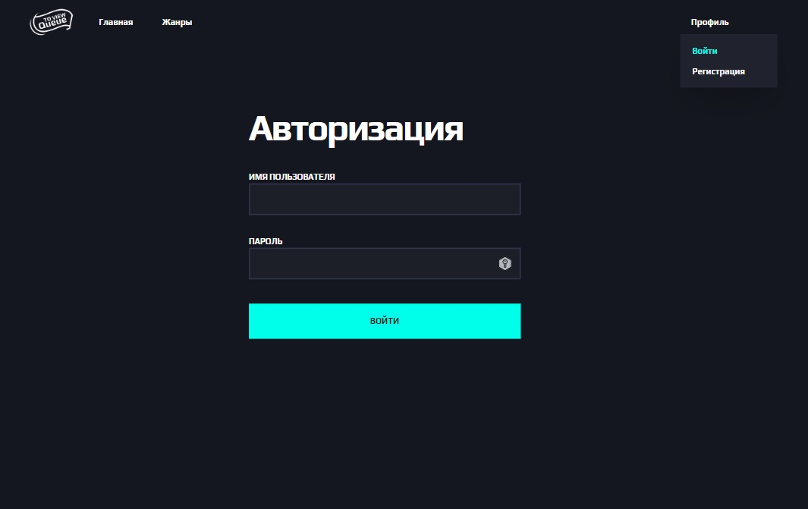
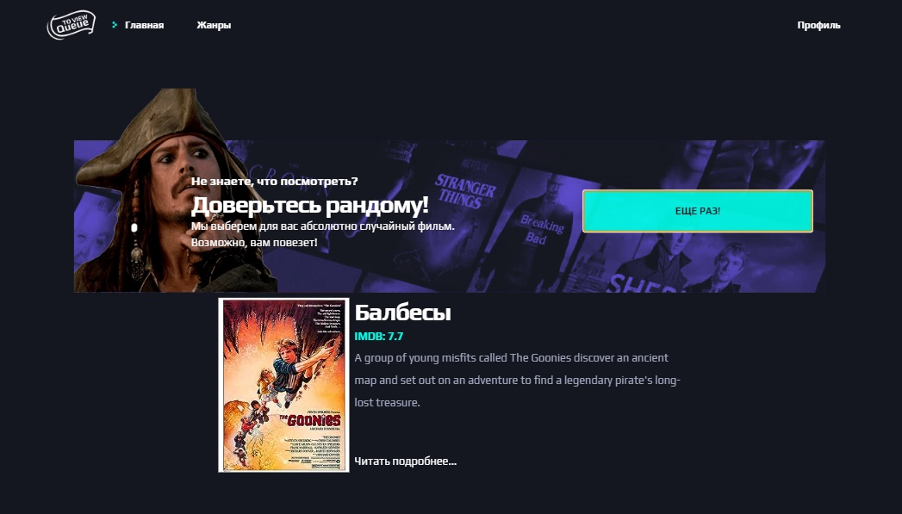
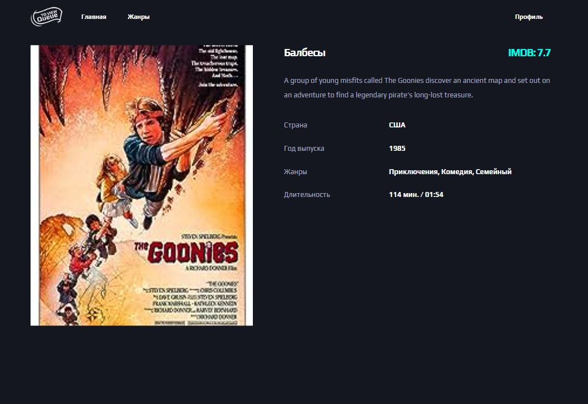
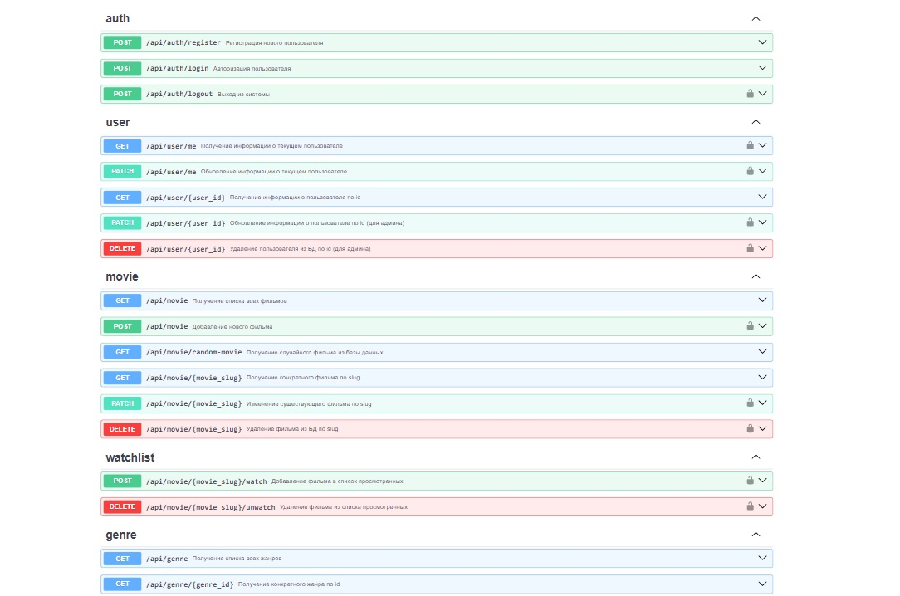
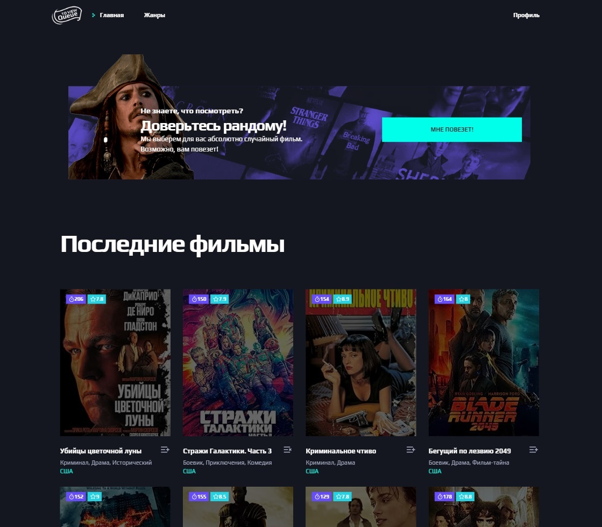

# Queue to View
<a href="https://fastapi.tiangolo.com/" target="_blank">
    
</a>
<a href="https://react.dev/" target="_blank">
    
</a>
<a href="https://www.docker.com/" target="_blank">
    
</a>

## Описание проекта
**Queue to View** — это веб-каталог фильмов с парсингом базы IMDB. Проект представляет из себя платформу для кинолюбителей, где они могут найти фильмы по душе, добавить их в пользовательский список, прокомментировать или обсудить с другими участниками. 

В рамках проекта реализованы:

- [x] Асинхронный RESTful API на FastAPI, позволяющий пользоваться ресурсом под своей учетной записью с разными уровнями доступа (аноним, пользователь и суперпользователь).
- [x] Парсер данных с IMDB на Scrapy. Парсер не только собирает, но и подготавливает данные в требуемом API формате, чтобы их можно было удобно вставить.
- [x] Интерфейс командной строки для управления проектом. После разворачивания проекта в командной строке контейнера с бэкендом доступны команды ```qtv [command]```, позволяющие быстро приступить к работе.
- [x] Фронтенд на React. В качестве стейт-менеджера используется Redux (в реализации Redux Toolkit). Фронтенд связан с бэкендом с помощью nginx. Кроме того, nginx отвечает за раздачу статики.
- [x] Быстрый подъем всей инфраструктуры проекта с помощью Docker.

## Фотогалерея
<details>
<summary>Развернуть остальные изображения</summary>






</details>



## Запуск с помощью Docker
Клонируйте репозиторий. Создайте в корне проекта .env файл [по образцу](.env.example). Выполните команду:
```bash
docker compose --env-file .env up -d
```

Если вы также хотите использовать Ngrok, то обязательно укажите профиль ```--profile host```. Кроме того, не забудьте указать значения для переменных окружения ```SERVER_HOST``` (ваш статический Ngrok-адрес) и ```NGROK_AUTHTOKEN``` (токен авторизации Ngrok). Также крайне рекомендуется указать ```SERVER_PROTO=https```, поскольку при работе Ngrok использует именно этот протокол.

```bash
docker compose --env-file .env --profile host up -d
```
<details>
<summary>Если контейнеры уже развернуты?</summary>

```bash
docker compose --env-file .env up --force-recreate --build -d

# или с Ngrok
docker compose --env-file .env --profile host up --force-recreate --build -d
```
</details>

По умолчанию приложение будет развернуто в трех контейнерах: db, backend, frontend, — и доступно по адресу [127.0.0.1](http://127.0.0.1/) (интерактивная документация к API по адресу [127.0.0.1/docs](http://127.0.0.1/docs)). Если вы использовали Ngrok, то приложение будет доступно по вашему Ngrok адресу.

### Первоначальная настройка приложения
Для быстрого заполнения базы данных пользователями и фильмами (из JSON файла) предусмотрены консольные команды. Выполните следующие шаги:

```bash
docker exec -it backend bash
```

Теперь вы сможете выполнять команды напрямую в backend-контейнере. Первым делом необходимо создать суперпользователя. Учтите, что ```qtv``` — по сути алиас для ```python -m cli```, чтобы команду можно было выполнять быстрее и удобнее.

```bash
qtv createuser
```

Далее в интерактивном режиме вам будет необходимо ввести Email, пароль, указать права (администратор или обычный пользователь). Чтобы быстро заполнить базу данных жанрами и фильмами, выполните:

```bash
qtv movieimport -f movies.json
```

В интерактивном режиме авторизуйтесь, указав данные суперпользователя, которого только что создали. Это необходимо, поскольку команда использует защищенный API-эндпоинт для создания записей о фильмах, который доступен только администраторам. Эта команда дополнительно создает жанры, если жанров в базе данных еще нет.

<details>
<summary>Подробнее про жанры</summary>

Поскольку в основе лежит парсинг фильмов с IMDB, мы принимали их систему жанров за эталон. Мы предполагаем, что жанры — статичная информация, поэтому не рекомендуется произвольно удалять или редактировать их. Это может привести к нарушениям в работе парсера или CLI, поскольку они опираются на перечень заранее определенных жанров. Если необходимо удалить или изменить жанр, то нужно внести соответствующие изменения в константы [здесь](./backend/cli/constants.py) и [здесь](./backend/parser/constants.py).

Жанры, если их еще нет в базе данных, создаются автоматически вместе с импортом результатов парсинга фильмов с IMDB, поскольку это необходимо для корректного сохранения результатов парсинга. Если вы не импортируете результаты парсинга, предполагается, что необходимые жанры будут созданы самостоятельно. Приложение в таком случае будет несовместимо или частично совместимо с парсером.
</details>